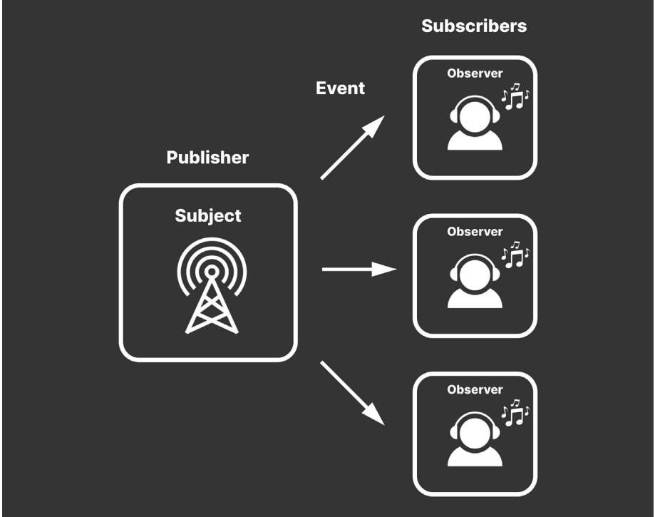

### UNITY FOR DEVELOPERS ⟶ E-BOOK


C R E A T E M O D U L A R G A M E A R C H I T E C T U R E I N U N I T Y W I T H SCRIPTABLEOBJECTS

## **Contents**

| Introduction. 3                                  |  |  |  |
|--------------------------------------------------|--|--|--|
| What are ScriptableObjects?. 4                   |  |  |  |
| Serialization. 7                                 |  |  |  |
| ScriptableObjects versus MonoBehaviours. 8       |  |  |  |
| Comparison. 9                                    |  |  |  |
| Callbacks and messages. 10                       |  |  |  |
| Files. 11                                        |  |  |  |
| YAML ain't markup language. 13                   |  |  |  |
| Creation and lifecycle 13                        |  |  |  |
| Destroying ScriptableObjects 14                  |  |  |  |
| Data containers. 15                              |  |  |  |
| ScriptableObject data versus persistent data. 18 |  |  |  |
| Reducing duplicate data 18                       |  |  |  |
| Design patterns. 19                              |  |  |  |
| Refactoring example 20                           |  |  |  |
| Code conventions in this guide. 22               |  |  |  |
| Custom Inspectors. 23                            |  |  |  |
| Architectural benefits. 25                       |  |  |  |
| ScriptableObject variables. 27                   |  |  |  |
| Dual serialization 29                            |  |  |  |
| Protect your data 31                             |  |  |  |
| Pattern: Extendable enums. 32                    |  |  |  |
| Enum-like categories. 33                         |  |  |  |
| Extending behavior 35                            |  |  |  |
| Pattern: Delegate objects. 38                    |  |  |  |
| Delegates versus events 39                       |  |  |  |
| ScriptableObjects methods. 40                    |  |  |  |

|                          | Modifying ScriptableObject data 41           |  |  |
|--------------------------|----------------------------------------------|--|--|
|                          | Pluggable behavior. 41                       |  |  |
|                          | AI with ScriptableObjects 42                 |  |  |
|                          | Example: Audio delegates. 42                 |  |  |
|                          | The glorious ScriptableObject revolution. 43 |  |  |
|                          | Pattern: Observer. 44                        |  |  |
|                          | Avoiding singletons 45                       |  |  |
|                          | ScriptableObject-based events 45             |  |  |
|                          | Example: Event channels. 48                  |  |  |
|                          | System.Action or UnityAction. 49             |  |  |
|                          | Debugging event channels. 53                 |  |  |
|                          | Example: InputReader. 54                     |  |  |
|                          | Static versus non-static events 56           |  |  |
| Pattern: Command. 57     |                                              |  |  |
|                          | ScriptableObjects or C# classes?. 61         |  |  |
| Pattern: Runtime Sets 62 |                                              |  |  |
|                          | Basic Runtime Set 63                         |  |  |
|                          | Generic version. 65                          |  |  |
|                          | Fun facts about foo and bar 67               |  |  |
|                          | Explore the sample project. 68               |  |  |
|                          | Conclusion. 70                               |  |  |
|                          | More resources. 72                           |  |  |
|                          | Documentation. 73                            |  |  |
|                          | Technical e-books from Unity. 73             |  |  |
|                          | From Unite.<br>73                            |  |  |
|                          | More project examples 73                     |  |  |
|                          | For game designers. 74                       |  |  |
|                          | Professional training for Unity creators. 74 |  |  |

## <span id="page-3-0"></span>INTRODUCTION

ScriptableObjects aren't flashy.

As Unity components go, they don't call attention to themselves. Instead, they quietly work behind the scenes. It's likely that you won't notice them – that is, until you need them.

You will often hear ScriptableObjects described as "data containers." That label, however, doesn't quite do them justice. Applied correctly, ScriptableObjects can help you speed up your Unity workflow, reduce memory usage, and simplify your code.

This guide assembles tips and tricks from professional developers for deploying ScriptableObjects in production. These include examples of how to apply them to specific design patterns and how to avoid common pitfalls.

If you're an intermediate to experienced Unity developer, ScriptableObjects can help promote clean coding practices by separating data from logic. This makes it easier to make changes without causing unintended side effects, improving testability and modularity.

Because you can work with them interactively in the Editor, you'll discover that ScriptableObjects are especially useful when you're collaborating with non-programmers, such as artists and designers. We hope that some of these techniques can complement your existing workflow and streamline your project setup.

Let's explore the unsung hero of game architecture, the humble ScriptableObject.

## <span id="page-4-0"></span>W H A T A R E SCRIPTABLEOBJECTS?

A [ScriptableObject](https://docs.unity3d.com/2022.2/Documentation/Manual/class-ScriptableObject.html?utm_source=demand-gen&utm_medium=pdf&utm_campaign=clean-code&utm_content=scriptable-objects-ebook) is a Unity object that's not part of a GameObject instance. You can use it to create a custom class with its own variables and methods, but with less overhead than a MonoBehaviour.

A ScriptableObject does not have a Transform and exists outside of the Scene Hierarchy. Instead, it lives at the project level as an asset, much like a material or 3D model.

You can declare a ScriptableObject like this:

```
[CreateAssetMenu(fileName="MyScriptableObject")]
public class MyScriptableObject: ScriptableObject
{
      public int someVariable;
}
```
Rather than deriving from MonoBehaviour, you inherit from ScriptableObject.

You can't use this directly on a GameObject. Instead, the CreateAssetMenu attribute gives you an extra action in your menus.

Navigate to **Assets > Create > MyScriptableObject** (or right-click in the Project window), and you can instantiate a custom asset from your ScriptableObject class.


Creating a ScriptableObject

Any other script can then reference this ScriptableObject asset from any scene, using a field:

```
public class MyMonoBehaviour : MonoBehaviour
{
 public ScriptableObject soInstance;
}
```
ScriptableObjects are especially useful for anything that doesn't need to change at runtime.

Because Unity treats ScriptableObjects as first-class objects, you can:

- Store them in variables
- Dynamically create or destroy them at runtime
- Pass them as arguments
- Return them from a method
- Include them in data structures
- Serialize/deserialize them

This last point highlights one of ScriptableObjects's key features: the ability to appear in the Inspector. This means that its fields are easy to read and modify in the Editor.

Change values in a ScriptableObject at runtime, and your game application updates immediately. Exit Play mode, and those values remain in place. This makes them useful for game designers who need to balance game [settings](https://blog.unity.com/games/systems-that-create-ecosystems-emergent-game-design?utm_source=demand-gen&utm_medium=pdf&utm_campaign=clean-code&utm_content=scriptable-objects-ebook) without having to write code. As a plus, ScriptableObjects can often store changes while the application is running.

This offers a few advantages over using MonoBehaviours alone. Restructuring your project with ScriptableObjects can help you collaborate better as a team or improve memory usage.

### <span id="page-7-0"></span>Serialization

[Serialization](https://docs.microsoft.com/en-us/dotnet/csharp/programming-guide/concepts/serialization/) is the automatic process of transforming data structures or object states into a format that's easier to store and reconstruct later. Unity's serialization backend takes data that's scattered over memory and then lays it out sequentially.

This reorganized data stream then can be stored in a database, a file, or memory. "Deserialization" is the reverse process.


## <span id="page-8-0"></span>S C R I P T A B L E O B J E C T S V E R S U S M O N O B E H AV I O U RS

<span id="page-9-0"></span>On the surface, ScriptableObjects are simple. The API sports only a few methods. In this case, that's a good thing. Simplicity means less can go wrong.


Unity Object UML

Like MonoBehaviour, the ScriptableObject class derives from [UnityEngine.Object](https://docs.unity3d.com/ScriptReference/Object.html?utm_source=demand-gen&utm_medium=pdf&utm_campaign=clean-code&utm_content=scriptable-objects-ebook) class.

#### Comparison

Probably the best way to understand ScriptableObjects is to compare them with their siblings, MonoBehaviours. This chart breaks down their similarities and differences.

| MonoBehaviour                                                                                                                                                                                      | ScriptableObject                                                                                                                                                                                                                                                                                                                  |  |  |  |
|----------------------------------------------------------------------------------------------------------------------------------------------------------------------------------------------------|-----------------------------------------------------------------------------------------------------------------------------------------------------------------------------------------------------------------------------------------------------------------------------------------------------------------------------------|--|--|--|
| MonoBehaviours and ScriptableObjects are both scripts.                                                                                                                                             |                                                                                                                                                                                                                                                                                                                                   |  |  |  |
| MonoBehaviour and ScriptableObject classes derive from UnityEngine.Object.                                                                                                                         |                                                                                                                                                                                                                                                                                                                                   |  |  |  |
| MonoBehaviours receive callbacks<br>from Unity.                                                                                                                                                    | ScriptableObjects do not receive most<br>callbacks from Unity.                                                                                                                                                                                                                                                                    |  |  |  |
| Connect your methods to the game<br>engine's player loop by naming them<br>according to MonoBehaviour's<br>event functions.<br>e.g., Start, Awake, Update, OnEnable,<br>OnDisable, OnCollisonEnter | ScriptableObjects support a limited<br>number of event functions, including<br>Awake, OnEnable, OnDestroy, and<br>OnDisable at runtime. The Editor<br>also calls OnValidate and Reset<br>from the Inspector.<br>You can create other methods on a<br>ScriptableObject, but the player loop does<br>not invoke them automatically. |  |  |  |

<span id="page-10-0"></span>

| MonoBehaviour                                                                                     | ScriptableObject                                                                                                                                                                          |  |  |
|---------------------------------------------------------------------------------------------------|-------------------------------------------------------------------------------------------------------------------------------------------------------------------------------------------|--|--|
| MonoBehaviours must be attached<br>to GameObjects at runtime.                                     | ScriptableObjects are not attached<br>to any specific GameObject.                                                                                                                         |  |  |
| If you create one at runtime,<br>use the AddComponent API.                                        | Save ScriptableObjects into their own<br>asset files at the Project level. Then,<br>reference the ScriptableObject asset from<br>a Monobehaviour or other script.                         |  |  |
| When we do save them, we save<br>MonoBehaviours data into Scenes<br>and Prefabs.                  | Each ScriptableObject instance<br>can be saved into its own file at the<br>Project level.                                                                                                 |  |  |
| In the Editor, changes to MonoBehaviour<br>values reset when exiting Play mode.                   | In the Editor, changes to<br>ScriptableObject values do not reset<br>when exiting Play mode.<br>In a standalone build, changes to<br>ScriptableObject values at runtime are<br>not saved. |  |  |
| MonoBehaviours and ScriptableObjects are both serializable and can be viewed<br>in the Inspector. |                                                                                                                                                                                           |  |  |

#### Callbacks and messages

ScriptableObjects have a subset of the event functions available to MonoBehaviours. You can define custom methods for your ScriptableObjects, but it's your responsibility to call them. Only these methods will be called automatically in the PlayerLoop.

| Event function<br>(runtime) | When it executes                                                                                                                                                                                       |
|-----------------------------|--------------------------------------------------------------------------------------------------------------------------------------------------------------------------------------------------------|
| Awake                       | This is called as the ScriptableObject script starts, similar to<br>MonoBehaviour's Awake callback.                                                                                                    |
|                             | This also executes when the game is launched or if a scene loads<br>with a reference to the ScriptableObject asset.                                                                                    |
| OnEnable                    | This is called when the ScriptableObject is loaded or instantiated,<br>immediately after the Awake callback.                                                                                           |
|                             | OnEnable executes during the ScriptableObject.CreateInstance or<br>after successful script recompilation.                                                                                              |
| OnDisable                   | When the ScriptableObject goes out of scope, this is called. This<br>happens if you load a Scene without references to the ScriptableObject<br>asset or right before the ScriptableObject's OnDestroy. |
|                             | Unity also executes OnDisable before script recompilations.<br>When entering Play mode, OnDisable runs right before OnEnable.                                                                          |

<span id="page-11-0"></span>

| Event function<br>(runtime) | When it executes                                                                                                                                                 |  |  |  |
|-----------------------------|------------------------------------------------------------------------------------------------------------------------------------------------------------------|--|--|--|
| OnDestroy                   | This is called when something destroys the ScriptableObject, either<br>deleting it in the Editor or from code.                                                   |  |  |  |
|                             | If you've created the ScriptableObject at runtime, OnDestroy also<br>invokes when the application quits or if the Editor exits Play mode.                        |  |  |  |
|                             | Note: This only destroys the native C++ part of the object. See<br>Lifecycle and Creation for more information.                                                  |  |  |  |
| Editor-only functions       |                                                                                                                                                                  |  |  |  |
| OnValidate                  | OnValidate executes when the script is loaded or a value changes<br>in the Inspector. This can be used to ensure that your data stays<br>within a certain range. |  |  |  |
| Reset                       | Reset invokes when you hit the Reset button in the Inspector<br>context menu.                                                                                    |  |  |  |

To destroy a ScriptableObject, remove it from the Editor or call Destroy/ DestroyImmediate at runtime.

Here's a brief overview of a ScriptableObject's event functions and life cycle. Compare this with the order of execution of [MonoBehaviour](https://docs.unity3d.com/Manual/ExecutionOrder.html?utm_source=demand-gen&utm_medium=pdf&utm_campaign=clean-code&utm_content=scriptable-objects-ebook) event functions, starting from the top.


ScriptableObject event functions and execution order

#### Files

One of their biggest differences between MonoBehaviours and ScriptableObjects is how they save their data.

Unity serializes MonoBehaviours within either a Scene or a Prefab file.

The saved data contains:

- The MonoBehaviour itself
- The attached GameObject
- Its Transform
- Any other components and MonoBehaviours on the attached GameObject

|                                     |  |  | MonoBehaviour |
|-------------------------------------|--|--|---------------|
|                                     |  |  | attaches to   |
|                                     |  |  | GameObject    |
|                                     |  |  |               |
|                                     |  |  |               |
|                                     |  |  |               |
|                                     |  |  |               |
|                                     |  |  |               |
|                                     |  |  |               |
|                                     |  |  |               |
|                                     |  |  |               |
| ScriptableObject appears in project |  |  |               |
|                                     |  |  |               |

ScriptableObject versus MonoBehaviour

In contrast, Unity saves ScriptableObjects into their own asset files. These files are smaller and more compartmentalized than MonoBehaviours.

If you choose to use **Mode: Force Text** in the **Project Settings > Asset Serialization** window, you can open a ScriptableObject asset in a text editor. It might look something like this:


A ScriptableObject instance, serialized as text

### <span id="page-13-0"></span>YAML ain't markup language

Unity uses a high performance serialization library that implements a subset of the YAML specification. This is a lightweight, easy-to-read language related to XML and JSON.

In YAML, data is organized as a hierarchy of nested elements. Each object has a Class ID, File ID, and object type. Note that ScriptableObjects use "MonoBehaviour" as their object type, instead of defining their own.


Under each object are its serialized properties, represented by key-value pairs.

For more information, read the blog post "[Understanding](https://blog.unity.com/engine-platform/understanding-unitys-serialization-language-yaml?utm_source=demand-gen&utm_medium=pdf&utm_campaign=clean-code&utm_content=scriptable-objects-ebook) Unity's serialization [language,](https://blog.unity.com/engine-platform/understanding-unitys-serialization-language-yaml?utm_source=demand-gen&utm_medium=pdf&utm_campaign=clean-code&utm_content=scriptable-objects-ebook) YAML."

#### Creation and lifecycle

The lifecycle of a ScriptableObject is similar to that of any other asset (materials, textures, and so on) in your project.

As in the previous example, apply the CreateAssetMenu attribute to your script in order to add a custom menu action to the Editor. You can optionally specify the default [fileName](https://docs.unity3d.com/ScriptReference/CreateAssetMenuAttribute-fileName.html?utm_source=demand-gen&utm_medium=pdf&utm_campaign=clean-code&utm_content=scriptable-objects-ebook) or menu item [order](https://docs.unity3d.com/ScriptReference/CreateAssetMenuAttribute-order.html?utm_source=demand-gen&utm_medium=pdf&utm_campaign=clean-code&utm_content=scriptable-objects-ebook). This is the most common way to create a ScriptableObject asset.

```
[CreateAssetMenu(fileName="MyScriptableObject"]
public class MyScriptableObject: ScriptableObject
{
      public int someVar;
}
```
<span id="page-14-0"></span>If you need to make a ScriptableObject instance at runtime, you can call the static CreateInstance method:

ScriptableObject.CreateInstance<MyScriptableObjectClass>();


Once you have the knack of creating and destroying your own ScriptableObjects, it's time to explore some creative ways to use them in your game application.

## <span id="page-15-0"></span>DATA CONTAINERS

The most common use for ScriptableObjects is as data containers for shared data, particularly for static game configuration data that doesn't change at runtime.

Typical use cases of ScriptableObjects may include:

- Inventories
- Enemy, player, or item statistics
- Audio collections

At runtime, you could store this data on MonoBehaviours, but doing so can be inefficient. As you saw in the previous comparison, MonoBehaviours carry extra overhead since they require a GameObject – and by default a Transform – to act as a host. That means that you need to create a lot of unused data before storing a single value.

To see for yourself, generate a new GameObject with an otherwise empty MonoBehaviour. Then, open the serialized object in a text editor:

```
GameObject:
  m_ObjectHideFlags: 0
  m_CorrespondingSource0bject: {fileID: 0}
  m_PrefabInstance: {fileID: 0} m_PrefabAsset: {fileID: 0}
  serializedVersion: 6
  m_Component:
  – component: {fileID: 7467558130563611466}
  – component: {fileID: 2006805663113952451}
  m_Layer: 0
  m_Name: GameObject
  m_TagString: Untagged
  m_Icon: {fileID: 0}
  m_NavMeshLayer: 0
  m_StaticEditorFlags: 0
  m_IsActive: 1
––– !u!4 &7467558130563611466
  Transform:
  m_ObjectHideFlags: 0
  m_CorrespondingSource0bject: {fileID: 0}
  m_PrefabInstance: {fileID: 0}
  m_PrefabAsset: {fileID: 0}
  m_GameObject: {fileID: 338842853706088653) m_LocalRotation: {x: 0, y: 0, z: 0, w: 1}
  m_LocalPosition: {x: -1.1780801, y: -2.6573246, z: -0.01486098} 
  m_LocalScale: {x: 1, y: 1, z: 1}
  m_ConstrainProportionsScale: 0
  m_Children: []
  m_Father: {fileID: 0}
  m_RootOrder: 0
  m_LocalEulerAnglesHint: {x: 0, y: 0, z: 0}
––– !u!114 &2006805663113952451
MonoBehaviour:
m_ObjectHideFlags: 0
m_CorrespondingSource0bject: {fileID: 0}
m_PrefabInstance: {fileID: 0}
```
A new GameObject with a barebones MonoBehaviour

Compare that with an empty ScriptableObject:


A ScriptableObject reduces overhead for storing data.

The ScriptableObject slims down this memory footprint and drops the GameObject and Transform. It also stores the data at the project level. That can be helpful, especially if you need to access the same data from multiple scenes.


<span id="page-18-0"></span>The extra data from a MonoBehaviour might not impact your application's performance at first, but as your game grows and has more objects, it will become noticeable.


#### Reducing duplicate data

Imagine you have a thousand GameObjects with custom MonoBehaviours, each with several fields.

If each component has its own copy of those member variables, that means you might be carrying around a lot of duplicate data.


Many objects with duplicate, local data leads to performance inefficiencies.

<span id="page-19-0"></span>Some data does not necessarily need to change at runtime, so this is a little inefficient. Instead, you can funnel that data into a ScriptableObject. Then, each of the thousand objects can point to this shared data asset. Each object stores a reference to the data rather than copying the data itself.


Many objects sharing data via a ScriptableObject

In software design, this is an optimization known as the [flyweight](http://www.gameprogrammingpatterns.com/flyweight.html) pattern. Restructuring your code in this way avoids copying a lot of values and reduces your memory footprint.

### Design patterns

Design patterns can help developers create more maintainable and flexible code, which can be useful in the often-changing world of game development.

Read *[Level up your code with game programming patterns](https://resources.unity.com/games/level-up-your-code-with-game-programming-patterns?ungated=true?utm_source=demand-gen&utm_medium=pdf&utm_campaign=clean-code&utm_content=scriptable-objects-ebook)* for more about SOLID principles and design patterns.

A reference to the ScriptableObject (instead of a full copy of the data) is comparatively small. As you scale up, the memory savings from not duplicating data can become significant.

<span id="page-20-0"></span>

| Memory Usage                                                                       |                                       |                               |               | Total: 6.22 GB                |
|------------------------------------------------------------------------------------|---------------------------------------|-------------------------------|---------------|-------------------------------|
|                                                                                    |                                       |                               |               | Total: 6.14 GB   Max: 6.22 GB |
|                                                                                    |                                       |                               |               |                               |
|                                                                                    | A                                     | B                             | A-B           |                               |
| Managed Heap (In use / Reserved)                                                   | 452.0 MB / 2.96 GB 433.9 MB / 2.96 GB |                               | 18.1 MB / 0 B |                               |
| Virtual Machine (Mono)                                                             | 182.2 MB                              | 156.1 MB                      | 6.1 MB        |                               |
| Graphics & Graphics Driver                                                         | 65.9 MB                               | 63.7 MB                       | 2.2 MB        |                               |
| Audio                                                                              | 1.3 MB                                | 1.3 MB                        | OB            |                               |
| Other Native Memory (In use / Reserved)                                            | 1.13 / 1.75 GB                        | 1.07 / 1.70 GB 56.3 / 53.0 MB |               |                               |
| Profiler (In use / Reserved)                                                       | 386.0 / 412.0 MB                      | 386.0 / 412.0 MB              | 2.2 KB / 0 B  |                               |
| Executable & DLLs                                                                  | 504.0 MB                              | 504.0 MB                      | OB            |                               |
| @ Untracked Memory                                                                 | 396.9 MB                              | 381.2 MB                      | 15.7 MB       |                               |
|                                                                                    |                                       |                               |               |                               |
| Managed Memory                                                                     |                                       |                               |               | Total: 0.60 GB                |
|                                                                                    |                                       |                               |               | Total: 0.58 GB   Max: 0.60 GB |
|                                                                                    |                                       |                               |               |                               |
| A                                                                                  | (B)<br>A-B                            |                               |               |                               |
|                                                                                    | 162.2 MB 156.1 MB 6.1 MB              |                               |               |                               |
| Virtual Machine (Mono)<br>Objects<br>58.9 MB<br>Empty Active Heap Space<br>32.5 KB | 30.2 MB 28.6 MB<br>16.0 KB 16.5 KB    | Removing duplicate data       |               |                               |

The Memory Profiler compares memory usage of duplicate (A) versus shared data (B).

You can store large quantities of shared data in this manner. Consider ScriptableObjects for:

- Saving and storing data during an Editor session
- Saving data as an Asset for use at runtime

Unlike MonoBehaviours, ScriptableObjects can't be attached to a GameObject. Instead, you save them as assets in your project. This is especially useful if you have a Prefab that uses unchanging data in its MonoBehaviours.

#### Refactoring example

Consider a MonoBehaviour that controls an NPC's health. You might define its class like this:

```
public class NPCHealthUnrefactored : MonoBehaviour
{
 [Range(10, 100)]
 public int maxHealth;
 [Range(10, 100)]
 public int healthThreshold;
 public NPCAIStateEnum goodHealthAi;
 public NPCAIStateEnum lowHealthAi;
 public int currentHealth;
}
```
This works, but you have data that you won't expect to change at runtime. If you have many objects with NPCHealthUnrefactored attached, this can lead to a lot of unnecessarily duplicated data.

| @ Inspector                             |                              | a       |   |
|-----------------------------------------|------------------------------|---------|---|
| NPCUnrefactored<br>V                    |                              | Static  |   |
| Tag Untagged                            | Layer Default<br>>           |         | D |
| 1<br>Transform                          |                              | 0<br>14 |   |
| # #<br>NPC Health Unrefactored (Script) |                              | 14<br>8 |   |
| Script                                  | NPCHealthUnrefactored        |         | O |
| Max Health                              |                              | 100     |   |
| Health Threshold                        |                              | 10      |   |
| Good Health Ai                          | IdleState (NPCAl State Enum) |         | 0 |
| Low Health Ai                           | FleeState (NPCAl State Enum) |         | O |
| Current Health                          | 100                          |         |   |

An NPCHealth MonoBehaviour before refactoring

Any data that does not need to change can move it into a ScriptableObject:

```
[CreateAssetMenu(fileName="NPCConfig")]
public class NPCConfigSO : ScriptableObject
{
 [Range(10, 100)]
 public int maxHealth;
 [Range(10, 100)]
 public int healthThreshold;
 public NPCAIStateEnum goodHealthAi;
 public NPCAIStateEnum lowHealthAi;
}
```
Use the CreateAssetMenu attribute to configure the menu action. You can optionally specify the default [fileName](https://docs.unity3d.com/ScriptReference/CreateAssetMenuAttribute-fileName.html?utm_source=demand-gen&utm_medium=pdf&utm_campaign=clean-code&utm_content=scriptable-objects-ebook) or menu item [order.](https://docs.unity3d.com/ScriptReference/CreateAssetMenuAttribute-order.html?utm_source=demand-gen&utm_medium=pdf&utm_campaign=clean-code&utm_content=scriptable-objects-ebook)

### <span id="page-22-0"></span>Code conventions in this guide

Many of the code samples in this guide are simplified for illustrative purposes and easier readability (e.g., public fields).

In production, use private fields and public [properties](https://learn.unity.com/tutorial/creating-properties?utm_source=demand-gen&utm_medium=pdf&utm_campaign=clean-code&utm_content=scriptable-objects-ebook) for additional encapsulation and flexibility. Apply the [SerializeField](https://docs.unity3d.com/ScriptReference/SerializeField.html?utm_source=demand-gen&utm_medium=pdf&utm_campaign=clean-code&utm_content=scriptable-objects-ebook) attribute to private fields to make them appear in the Editor's Inspector.

A naming convention can also help differentiate scripts for ScriptableObjects from MonoBehaviours. One way to achieve this is to add a "Data" or "SO" suffix at the end of the class name. While this isn't necessary, it can help keep your project organized and reduce ambiguity.

It's recommended that you maintain and follow a code style guide as your codebase grows. See *[Create a C# style guide](https://resources.unity.com/games/create-code-style-guide-e-book?ungated=true?utm_source=demand-gen&utm_medium=pdf&utm_campaign=clean-code&utm_content=scriptable-objects-ebook)* for more information.

Then the refactored NPCHealth component simplifies to this:

```
public class NPCHealth: MonoBehaviour
{
 // Reference to our ScriptableObject
 public NPCConfigSO config;
 public int currentHealth;
}
```
<span id="page-23-0"></span>The MonoBehaviour now contains a reference to this new ScriptableObject. In the Inspector, everything after refactoring looks similar, except the data is split.


Refactoring splits data between a MonoBehaviour and ScriptableObject

### Custom Inspectors

When separating data into a ScriptableObject, you have data contained in two places, the ScriptableObject asset and the MonoBehaviour referencing it.

To make your MonoBehaviours easier to navigate, consider creating a custom editor. Below is an example for the NPCHealth.

This allows you to inspect the NPCConfig's variables alongside the other properties in the MonoBehaviour. If you select the original NPCHealth Prefab, you can easily edit values in both objects.

A custom editor requires only a few lines of code:

- Derive a new class from Editor, and store this in a folder named "Editor." Apply the CustomEditor attribute with the NPCHealth type.
- Reserve a temporary editor for the NPCConfig ScriptableObject.
- In OnInspectorGUI, create the editor for the NPCHealth component.
- Draw the inspectors from the base class and new custom Inspector.

```
using UnityEditor;
   [CustomEditor(typeof(NPCHealth))]
   public class NPCHealthEditor : Editor
   {
    private Editor editorInstance;
    private void OnEnable()
    {
           // reset the editor instance
           editorInstance = null; 
    }
    public override void OnInspectorGUI()
    {
           // the inspected target component
           NPCHealth npcHealth = (NPCHealth)target;
           if (editorInstance == null)
               editorInstance = Editor.
   CreateEditor(npcHealth.config);
           // show the variables from the MonoBehaviour 
           base.OnInspectorGUI();
           // draw the ScriptableObjects inspector
           editorInstance.DrawDefaultInspector();
    }
   }
You can expand on this example with custom property drawers and editor
```
attributes. This can even make for a better user experience when working with ScriptableObjects.

#### <span id="page-25-0"></span>Architectural benefits

With ScriptableObjects, you can cleanly separate shared data and unshared data. Anything unique to the GameObject instance remains inside the MonoBehaviour, while the shared data appears in the ScriptableObject. Architecture with ScriptableObjects, however, goes beyond just saving memory.


There are a few benefits to restructuring the code architecture:

— **Designers can work more independently from software developers:** Storing data and logic on a single MonoBehaviour creates the potential for developers and game designers to step over each other's work. If two people change different parts of the same Prefab or scene, this results in a merge conflict. Resolving issues like this can be time consuming and frustrating.

Breaking off shared data into smaller files and assets reduces these problems. Architecting with ScriptableObjects can let designers build gameplay without always relying on a programmer – and everyone is happier as a result.

Just be prepared to define a clear workflow between your teams when sharing data. Good communication and establishing some boundaries can help prevent issues here. Some extra error checking or data validation may be necessary as well (e.g., use a Range attribute or OnValidate to prevent bad values).

— **Editing shared data is faster and less error-prone:** Changes to the shared data now happen all at once. If you need to modify a setting for your NPCs, for example, you could adjust it in just one location, and have it update for every affected component in every scene.

This reduces any potential errors from mass editing a large number of individual GameObjects by hand. Offloading data into ScriptableObjects can also help with version control and prevent merge conflicts when teammates work on the same scene or Prefab.

— **Save gameplay tweaks in Play mode:** Play mode in the Editor is an opportunity for designers to experiment with gameplay and settings. However, any modifications made to MonoBehaviours are lost when exiting Play mode because Unity discards the temporary copy of the scene.

Because the ScriptableObjects are assets, changes to their values update regardless of whether Unity is in Play mode. This can be useful if you want to make adjustments at runtime.

This can be a liability, however, if you want to revert those changes. Just remember to rely on Unity Version Control (formerly [PlasticSCM](https://unity.com/products/plastic-scm?utm_source=demand-gen&utm_medium=pdf&utm_campaign=clean-code&utm_content=scriptable-objects-ebook), [Git,](https://git-scm.com/) or another version control system, so you can always restore your work if necessary. See our *[Version control and project organization best practices](https://resources.unity.com/games/version-control-project-organization-best-practices-ebook?ungated=true?utm_source=demand-gen&utm_medium=pdf&utm_campaign=clean-code&utm_content=scriptable-objects-ebook)  [guide](https://resources.unity.com/games/version-control-project-organization-best-practices-ebook?ungated=true?utm_source=demand-gen&utm_medium=pdf&utm_campaign=clean-code&utm_content=scriptable-objects-ebook)* for more information.

— **Improve scene loading times:** When saving a scene or Prefab, Unity serializes everything inside of them. That includes every GameObject, every component attached to those GameObjects, and every public field. Unity does this without checking for duplicate data.

Moving data to ScriptableObjects can reduce your scene and Prefab sizes. Because disk I/O is still relatively slow, this can noticeably impact loading and saving.

### <span id="page-27-0"></span>ScriptableObject variables

You can make your shared data containers even more granular with a ScriptableObject representing just one value. For instance, you could create a ScriptableObject class called IntVariable that holds one public field called value:

```
using UnityEngine;
```
{

}

}

```
[CreateAssetMenu(menuName = "Variables/Int", order = 1)]
public class IntVariableSO : ScriptableObject
```

```
 public int value;
```
Then, you could use the IntVariable in a MonoBehaviour. Structuring a PlayerHealth class would then look like this:

public class PlayerHealth : MonoBehaviour {

public IntVariableSO health;

Though we normally think of ScriptableObjects as holding unchanging values, you can give them methods that update this data at runtime (and reset to an initial value when exiting Play mode). In this way, you can make ScriptableObjects that essentially function as variables – containing integers, floats, booleans, and so on.

Your designers can then reserve data for game logic without needing a software developer each time they want to do it. However, this requires planning to be successful. Decide with your designers how to divide authoring gameplay data.

Set some boundaries on how to collaborate. For example, the programming team might do the initial setup of ScriptableObjects for use with an inventory system. Then, the design team could use those to fill in each item's in-game stats or behaviors.

With some extra Editor scripting, this can become a near-seamless experience. Another possibility is making the fields in the Inspector toggle between using a shared value from a ScriptableObject and a constant. This can allow the game design team greater freedom to override the ScriptableObject data per instance.

See the "Game architecture with [ScriptableObjects"](https://www.youtube.com/watch?v=raQ3iHhE_Kk?utm_source=demand-gen&utm_medium=pdf&utm_campaign=clean-code&utm_content=scriptable-objects-ebook) presentation from Unite Austin for how to implement this behavior in your own projects. You can also download the open source Unity [Atoms](https://github.com/unity-atoms/unity-atoms) project to see a working implementation of ScriptableObject variables.

#### Dual serialization

You can mix how to serialize data within Unity. This allows you to work with ScriptableObjects in the Editor, but then store their data in another location, such as a JSON or XML file. This allows you to take advantage of each format's strengths.

File formats like JSON and XML can be difficult to work with in the Editor but are easy to modify outside of Unity with any text editor.

In contrast, ScriptableObjects work well in the Editor and can be swapped with a quick drag-and-drop operation. However, they aren't easy to modify outside of Unity or share within your community of players.

Mixing serialized formats could open up new possibilities for your game, such as level editing or modding. At build time, a script can convert the other files into ScriptableObjects, which is faster to load than plain text.

While you'll want to keep some sensitive data safely tucked away on your servers (e.g., virtual currency, account information), exposing part of your game data to the community may enhance gameplay. If you open up a sandbox level

<span id="page-29-0"></span>for user experimentation, you might be surprised how players could build their own levels to be shared online.

Imagine a ScriptableObject that defines your game level layout. It may simply contain a number of Transforms that define placement of Prefabs, starting configurations, and so on. Your game scripts will use this data to assemble each level.

Imagine the walls and starting positions of a game, stored within a ScriptableObject:

```
[CreateAssetMenu(fileName ="LevelLayout")]
public class LevelLayout : ScriptableObject
{
 public Vector3[] wallPositions = new Vector3[2];
 public Vector3[] playerPositions = new Vector3[2];
 public Vector3[] goalPositions = new Vector3[2];
 public Vector3 ballPosition;
}
```
This defines how you set up the level. Your level management scripts can read the data from the LevelLayout object, then instantiate your Prefabs in their correct positions.

A custom script can use JsonUtility to export this same data to disk. This results in a text file outside of the Editor that your users can modify with external tools.

To load a custom modded level, ScriptableObject.CreateInstance can generate a ScriptableObject at runtime. Then, read the text from the JSON file to populate the ScriptableObject. This LoadLevelFromJson example method shows that in action:

```
using System.IO;
public class LevelManager : MonoBehaviour
{
 public ScriptableObject levelLayout;
 public void LoadLevelFromJson(string jsonFile)
 {
        if (levelLayout == null)
        {
            levelLayout = ScriptableObject.
CreateInstance<LevelLayout>();
        }
        var importedFile = File.ReadAllText(jsonFile);
        JsonUtility.FromJsonOverwrite(importedFile, 
levelLayout);
 }
}
```
Your custom data replaces the contents of the ScriptableObject and allows you to use this externally modded level like any other in your game. The application is none the wiser.

Be sure to see this work for yourself in the [sample](https://github.com/UnityTechnologies/PaddleGameSO) project. If we load a modified JSON file, this customized level overrides the default level data on the ScriptableObject.

<span id="page-31-0"></span>

Mix serialized formats for more flexibility

**Note:** When deserializing JSON into ScriptableObjects with JsonUtility, you must use the [FromJsonOverwrite](https://docs.unity3d.com/2019.4/Documentation/ScriptReference/JsonUtility.FromJsonOverwrite.html?utm_source=demand-gen&utm_medium=pdf&utm_campaign=clean-code&utm_content=scriptable-objects-ebook) method.

Instead of creating a new object and loading the JSON data into it, JsonUtility loads the JSON data into an existing object. This updates the values stored in classes or objects without any allocations.

## Protect your data

This simple mod example demonstrates one possible application of ScriptableObjects. However, when exposing game data for modification, you should exercise caution to avoid players tampering with the rest of your application.

Here are common ways to protect anything that you don't want modded:

- **Encryption:** Use [encryption](https://en.wikipedia.org/wiki/Public-key_cryptography) to protect data files from being easily read or modified. This can make it more difficult for users to alter critical data.
- **Digital signatures:** You can use a [fingerprint](https://en.wikipedia.org/wiki/Fingerprint_(computing)) algorithm to verify that your data files have not been tampered with.
- **Server-side validation:** If your game relies on data that is stored on a server, check the data on the server before it is used in the game, and reject any data that appears to have been manipulated.

No single approach is foolproof, and it's generally a good idea to use a combination of these techniques so your players don't introduce any bugs or vulnerabilities into your game.

## <span id="page-32-0"></span>P A T T E R N : EXTENDABLE ENUMS

<span id="page-33-0"></span>Game development can resemble déjà vu because it often requires the task of solving recurring or similar problems. Fortunately, you can tap into the collective knowledge of software engineers who've already "been there and done that" with design [patterns.](https://resources.unity.com/games/level-up-your-code-with-game-programming-patterns?ungated=true?utm_source=demand-gen&utm_medium=pdf&utm_campaign=clean-code&utm_content=scriptable-objects-ebook)

Design patterns are general solutions that can help you build larger, scalable applications. They can improve code readability and make your codebase cleaner. Design patterns reduce refactoring and the time spent testing.

Think of a design pattern as template for solving common issues like:

- Storing a lot of data efficiently
- Getting objects from different game systems to speak to each other
- Swapping out behavior on the fly at runtime

ScriptableObjects can help implement some of these patterns. You've already seen how they can function as data containers, but they can do more than simply save values or settings. The next few sections explore how you can go beyond using ScriptableObjects to save data.

#### Enum-like categories

In fact, ScriptableObjects actually don't have to contain anything at all to be useful. If you create an empty ScriptableObject, you'll discover that it still has utility, even if it's only used for comparing against other ScriptableObjects.

In your game application, suppose you make a number of assets from an empty GameItemSO ScriptableObject, like so:

```
Using UnityEngine;
[CreateAssetMenu(fileName="GameItem")]
public class GameItemSO : ScriptableObject
{
}
```


Empty ScriptableObjects work as enums.

This allows you to generate any number of assets within the project. Even without containing any data, the ScriptableObject itself can represent a category or item type. If you are checking for equality, this works very similarly to an enum.

Do two variables refer to the same ScriptableObject? Then they're the same item type. Otherwise, they're not.

So, you could have a ScriptableObject that defines special damage effects (e.g., cold, heat, electrical, magic, and so on) or rock-paper-scissors designations from your favorite [zero-sum](https://en.wikipedia.org/wiki/Rock_paper_scissors) game.


Comparing ScriptableObjects


<span id="page-35-0"></span>If your application requires an inventory system to equip gameplay items, ScriptableObjects can represent item types or weapon slots. The fields in the Inspector then function as a drag-and-drop interface for setting them up.


Drag and drop ScriptableObject-based categories

This artist-friendly UI allows your designers how to modify and extend gameplay data without extra support from a software developer. Giving the design team the means and responsibility of maintaining gameplay data allows everyone to focus on what they do best.

#### Extending behavior

Using ScriptableObjects as enums becomes more interesting when you want to extend them and add more data. Unlike normal enums, ScriptableObjects can have extra fields and methods.

Here's the adapted rock-paper-scissors GameItem. The ScriptableObject asset itself still defines the enum-like category, but this time it's no longer empty.

```
public class GameItem : ScriptableObject
{
 public GameItem weakness;
 public bool IsWinner(GameItem other)
 {
       return other.weakness == this;
 }
}
```
The ScriptableObject now contains a weakness field that determines which other item wins in a potential interaction. In addition to storing data, each ScriptableObject also contains simple comparison logic in IsWinner.

Each gameplay item then needs a MonoBehaviour that references a specific ScriptableObject asset. This example works as a controller script:

```
public class GameItemController : MonoBehaviour
{
 // rock, paper, scissors
 public GameItem gameItem;
 private void OnTriggerEnter(Collider other)
 {
       GameItemController otherController = other.
GetComponent<GameItemController>();
       GameItem otherGameItem = otherController.gameItem;
       if (gameItem.IsWinner(otherGameItem))
       {
           Debug.Log(gameItem.name + " beats " + 
otherGameItem.name);
       }
 }
}
```
It references a ScriptableObject as a field. In OnTriggerEnter, you can check the IsWinner method to see which emerges victorious when the gameItem comes in contact with another. This sets the stage for some [Rochambeau-like](https://youtu.be/JKsn-PaNo1Y?t=3019) [conflict](https://youtu.be/JKsn-PaNo1Y?t=3019).

Unlike enums, ScriptableObjects are easy to extend. There's no need to have a separate lookup table or to correlate with a new array of data. Simply add an extra field and/or method to handle the logic.


ScriptableObjects with comparison logic Source: [Flaticon](https://www.flaticon.com/free-icon/rock-paper-scissors_4144475)

Compare that with maintaining a traditional enum. If you have a long list of enum values without explicit numbering, inserting or removing an enum can change their order. This reordering can introduce subtle bugs or unintended behavior.

ScriptableObject-based enums have no such issues. Add more to your project (or delete existing ones), and everything just works.

Suppose you wanted to make the item equippable in an RPG. You could append an extra boolean field to the ScriptableObject to do that. Are certain characters not allowed to hold certain items? Are some items magical or have special abilities? ScriptableObject-based enums can do that.

Your gameplay data can thus evolve as you work with your designers. While you'll need to coordinate how to set up fields initially, later the designers can fill out the details independently.

## <span id="page-38-0"></span>PAT TERN: DELEGATE OBJECTS

#### <span id="page-39-0"></span>Pattern: Delegate objects

Because you can create methods on a ScriptableObject, they are useful for containing logic or actions as much as they are for holding data. In this way, you can use them as delegate objects.


#### Delegates versus events

A delegate is a type that defines a method signature. This allows you to pass methods as arguments to other methods. Think of it like a variable that holds a reference to a method, instead of a value.

An event, on the other hand, is essentially a special type of delegate that allows classes to communicate with each other in a loosely coupled way. Events are explored in more detail in the Pattern: [Observer](#page-44-0) chapter.

For general information about the differences between delegates and events, see [Distinguishing](https://learn.microsoft.com/en-us/dotnet/csharp/distinguish-delegates-events) Delegates and Events in C#.

The idea is that if you need to perform specific tasks, you encapsulate the algorithms for doing those tasks into their own objects. The original Gang of Four refers to this general design as the [strategy](https://en.wikipedia.org/wiki/Strategy_pattern) pattern.

Suppose you want a pathfinding object that calculates a route through a maze. The object itself wouldn't actually contain any pathfinding logic. Instead, it just keeps a reference to another object that does.

If you want to solve the maze with a specific path search [technique](https://en.wikipedia.org/wiki/Strategy_pattern) (e.g., A\*, Dijkstra, etc.), implement the correct solution within this separate "strategy" object. At runtime, you can then swap to a different algorithm by exchanging objects.


#### <span id="page-40-0"></span>ScriptableObjects methods

In Unity, one way to implement this pattern is to have a MonoBehaviour reference a ScriptableObject containing the necessary logic. When the MonoBehaviour performs a task, it calls the external methods on the ScriptableObject rather than its own.

However, there a few limitations to this:

- Methods on a ScriptableObject won't be called automatically from the MonoBehaviour's player loop. You need to call them yourself.
- Like Prefabs, ScriptableObjects can't reference scene objects directly. If they need to perform work on a scene object, you'll need to pass that object in as a parameter.

When calling the ScriptableObject's methods, a MonoBehaviour can often pass in itself as the argument or pass in any other dependencies. This gives you the flexibility to execute logic, run coroutines, etc. even though the ScriptableObject exists at the project level.


ScriptableObjects can contain pluggable implementations of behavior or logic.

For example, you can define several enemy units in a game with different movement behavior. Let's suppose some of them need to patrol, stand idle, or flee from the player.

A single EnemyUnit MonoBehaviour can reference a EnemyAI ScriptableObject that contains a method called MoveUnit. The EnemyUnit script itself doesn't contain any movement or behavior logic. It only executes the ScriptableObject's MoveUnit at the appropriate time.

If the method needs data from the scene, the EnemyUnit object can pass in a reference to itself as a parameter. Any other necessary dependencies in the scene can be passed in as well.

### <span id="page-41-0"></span>Modifying ScriptableObject data

At runtime, you actually can change ScriptableObject data, but be careful whenever doing so. Multiple MonoBehaviour sharing the same ScriptableObject can cause problems if they modify the same data.

Remember that you can create an *instance* of a ScriptableObject at runtime to avoid this issue. The initial ScriptableObject then acts like a template with all the logic and data. Each MonoBehaviour can then make its own instance of that ScriptableObject which can be modified freely.

#### Pluggable behavior

You can make this pattern more useful by defining the EnemyAI ScriptableObject as an abstract class. This allows it to act as a template for a variety of ScriptableObjects that are compatible with the EnemyUnit MonoBehaviour, so the abstract ScriptableObject can stand in for more than one algorithm.


Pluggable behaviors can change at runtime or in the Editor.

Thus, you could have concrete ScriptableObject classes for behaviors like Patrol, Idle, or Flee that derive from the base EnemyAI. Even though they all implement the same MoveUnit method, each can produce very different results.

In the Editor, each asset is interchangeable. You can just drag and drop the ScriptableObject of choice into the EnemyAI field. Any compatible ScriptableObject is "pluggable" in this fashion.

<span id="page-42-0"></span>The EnemyUnit or another component can behave as the "brain" that monitors when to switch ScriptableObjects and also swap behavior at runtime. This is one way the EnemyUnit can react to gameplay events. Simply switch EnemyAI ScriptableObjects on each state change.

In production, a second developer or designer can implement the actual movement or AI logic within the ScriptableObject. As additional movements or behaviors get added to the game (e.g., DuckAndCover, Chase, etc.), the original EnemyUnit script remains unchanged. This pattern can help keep your codebase more extensible, in keeping with the [open-closed](https://en.wikipedia.org/wiki/Open%E2%80%93closed_principle) principle from [SOLID](https://en.wikipedia.org/wiki/SOLID) programming. Because everything is already split into smaller objects, the resulting project is more scalable as you add team members.

## AI with ScriptableObjects

For a more detailed example of using ScriptableObjects to drive behavior, see the Pluggable AI With [Scriptable](https://www.youtube.com/watch?v=cHUXh5biQMg?utm_source=demand-gen&utm_medium=pdf&utm_campaign=clean-code&utm_content=scriptable-objects-ebook) Objects video series. These recorded live sessions demonstrate a finite state machine-based AI system that can be configured using ScriptableObjects for states, actions, and transitions between those states.

#### Example: Audio delegates

The behavior contained in the ScriptableObject does not necessarily need to be complex. It can be something as basic as playing back a customized sound.

Here's an example of a "sound delegate" ScriptableObject that can help add variations to your AudioClips. The AudioDelegateSO defines an abstract class with a Play method that takes an AudioSource as a parameter.

```
using UnityEngine;
using Random = UnityEngine.Random;
using System;
[Serializable]
public struct RangedFloat
{
      public float minValue;
      public float maxValue;
}
public abstract class AudioDelegateSO: ScriptableObject
{
      public abstract void Play(AudioSource source);
}
```
<span id="page-43-0"></span>This concrete SimpleAudioDelegate ScriptableObject can then select a random clip from the available choices and vary its volume and pitch during playback. This reduces the monotony of repeating the same sound.

```
[CreateAssetMenu(fileName ="AudioDelegate")]
public class SimpleAudioDelegateSO : AudioDelegateSO
{
      public AudioClip[] clips;
      public RangedFloat volume;
      public RangedFloat pitch;
      public void Play(AudioSource source)
      {
             if (clips.Length == 0 || source == null) 
                    return;
             source.clip = clips[Random.Range(0, clips.
Length)];
             source.volume = Random.Range(volume.minValue, 
volume.maxValue);
             source.pitch = Random.Range(pitch.minValue, pitch.
maxValue);
             source.Play();
      }
}
```
Any MonoBehaviour can then use a ScriptableObject instance derived from the AudioDelegateSO class. You can also make variations of the AudioDelegate for different audio effects.

Having methods on a ScriptableObject opens up several possibilities. In addition to performing actions, its methods can send messages to any object in the scene.

Next, let's look at a ScriptableObject-based event system with the observer pattern.


## <span id="page-44-0"></span>PAT TERN: OBSERVER

<span id="page-45-0"></span>When developing a game, it's common to have multiple GameObjects that need to share data or states with each other. In a small game, you can make direct references between these objects, but this doesn't scale. Managing these dependencies can require significant effort and is often a source of bugs.

You'll need a better solution as your application grows in size.

#### Avoiding singletons

Many developers opt to use singletons – one global instance of a class that survives scene loading. Singletons, however, introduce global states and make unit testing difficult.

If you're working with a Prefab that references a singleton, you'll end up importing all of its dependencies just to test an isolated function. This reduces modularity and debuggability.

Consider an alternate solution to help your objects communicate: ScriptableObject-based events.


#### More on singletons

The subject of singletons in Unity game development is often cause for debate. Singletons may be a suitable solution for smaller projects or prototyping. In large applications, the cons of using singletons often outweigh their advantages. Many developers consider the singleton to be an anti-pattern.

Singletons are easy to learn and understand but can introduce issues when they're used incorrectly. Most of the patterns described here will help you avoid relying on singletons.

If you want easy access to shared data, consider a Runtime Set based on ScriptableObjects (see below). If you need a way to send messages between objects, try a ScriptableObject-based event channel. Restructuring your architecture away from singletons may improve scalability and testability.

Read the e-book *[Level up your code with game programming patterns](https://resources.unity.com/games/level-up-your-code-with-game-programming-patterns?ungated=true?utm_source=demand-gen&utm_medium=pdf&utm_campaign=clean-code&utm_content=scriptable-objects-ebook)* to learn more about the pros and cons of singletons.

#### ScriptableObject-based events

As you've already seen, ScriptableObjects aren't just for handling data. They can contain methods, just like any other script. These methods can serve as a means for objects to communicate.


In the [observer](https://en.wikipedia.org/wiki/Observer_pattern) design pattern, a subject broadcasts a message to one or more loosely decoupled observers. Each observing object can react independently of the subject but is unaware of the other observers. The subject can also be referred to as the "publisher" or "broadcaster." The observers are also known as "subscribers" or "listeners."

An event-based architecture only executes when needed, rather than running each frame. For this reason, it's often more optimized than adding logic to a MonoBehaviour's update methods.



The basic observer pattern

You can implement the observer pattern with MonoBehaviours or C# [objects.](https://learn.microsoft.com/en-us/dotnet/csharp/programming-guide/events/)  While this is already common practice in Unity development, a script-only approach means your designers will rely on the programming team for every event needed during gameplay.

An alternative is to create ScriptableObject-based events. This is a designerfriendly way to set up the observer pattern. Here, the ScriptableObject works as an intermediary between subject and observer, providing a graphical interface in the Editor.


The ScriptableObject-based event channel

<span id="page-48-0"></span>While at first glance it appears that you've only added a layer of overhead to the observer pattern, this structure offers some advantages. Because ScriptableObjects are assets, they are accessible to all objects in your Scene Hierarchy and don't disappear on scene loading.

This is why many developers use singletons in the first place: easy, persistent access to certain resources. ScriptableObjects can often provide the same benefits without introducing as many unnecessary dependencies.

In ScriptableObject-based events, any object can serve as publisher (which broadcasts the event), and any object can serve as a subscriber (which listens for the event). The ScriptableObject sits in the middle and helps relay the signal, acting like a centralized intermediary between the two.

One way to think about this is as an "event channel." Imagine the ScriptableObject as a radio tower that has any number of objects listening for its signals. An interested Monobehaviour can simply subscribe to the event channel and respond when something happens.

#### Example: Event channels

Any ScriptableObject that includes the following can function as an event channel:

— **A delegate (UnityAction or System.Action)**: This notifies subscribers and passes the appropriate data as parameters. Use a UnityAction for a more artist-friendly experience; otherwise, the System.Action delegate works well here.

The event keyword limits the delegate so that it can only be invoked from within the ScriptableObject class (or derived class where it's declared).

— **An event-raising method:** This public method invokes the delegate.

And that's it.

You can set up any number of event channels to determine various aspects of gameplay. Because they exist at the project level, ScriptableObjects can raise events that are globally accessible. This can connect otherwise unrelated objects in the scene.

### <span id="page-49-0"></span>System.Action or UnityAction

[System.Action](https://learn.microsoft.com/en-us/dotnet/api/system.action?view=net-7.0) is a general purpose delegate type defined in the .NET Framework's System namespace. It can be used in your Unity projects without needing to declare a custom delegate. Adding the event keyword makes the delegate type read only; other objects can listen for the delegate's registered methods, but they can't invoke those methods directly.

[UnityAction](https://docs.unity3d.com/ScriptReference/Events.UnityAction.html?utm_source=demand-gen&utm_medium=pdf&utm_campaign=clean-code&utm_content=scriptable-objects-ebook) is a delegate type that's specifically defined within the UnityEngine. Events namespace. You will typically use it with the [UnityEvent](https://docs.unity3d.com/ScriptReference/Events.UnityEvent.html?utm_source=demand-gen&utm_medium=pdf&utm_campaign=clean-code&utm_content=scriptable-objects-ebook) class, which is an alternative means of creating events in Unity. UnityEvents and UnityActions appear in the Inspector, so they often serve as a more user- or artist-friendly way to implement the observer pattern.

In general, you can use either System.Action or UnityAction, depending on your specific needs. You have the option of deploying either or both in the same project.

If you want a more general purpose delegate that is not tied to the Unity game engine, use System.Action. If you want a delegate specifically designed for UnityEvents, use UnityAction.

Here, you can make a VoidEventChannelSO that raises an event without passing any parameters. This one contains a UnityAction named OnEventRaised.

```
[CreateAssetMenu(menuName = "Events/Void Event Channel")]
public class VoidEventChannelSO : ScriptableObject
{
      public event UnityAction OnEventRaised;
      public void RaiseEvent()
      {
             if (OnEventRaised != null)
                    OnEventRaised.Invoke();
      }
}
```
Once you create a ScriptableObject of type VoidEventChannelSO, any MonoBehaviour can listen for OnEventRaised. For example, we can make a StartNewGame ScriptableObject that is of type VoidEventChannelSO.

Another object can invoke the public RaiseEvent method to trigger the event.

| 昌 Console<br>Project                                                                                                                     |                                                         |
|------------------------------------------------------------------------------------------------------------------------------------------|---------------------------------------------------------|
| +<br>V                                                                                                                                   | a                                                       |
| Dialogue                                                                                                                                 | A Assets > ScriptableObjects > EventChannels > MainMenu |
| Gameplay<br>Health<br>Interaction<br>Inventory<br>MainMenu<br>Questlines<br>QuestSystem<br>SceneManagement<br>Settings<br>UI<br>Gameplay | StartNewGame<br>ContinueGameEv                          |
|                                                                                                                                          |                                                         |

A ScriptableObject-based event, an example of an event channel

Another MonoBehaviour can reference the event channel ScriptableObject in the Inspector, then subscribe/unsubscribe to OnEventRaised.

This invokes StartNewGame as a response whenever the event channel calls OnEventRaised:

```
public class StartGame : MonoBehaviour
{
       [SerializeField] private VoidEventChannelSO 
_onNewGameButton = default;
       private void Start()
       {
              _onNewGameButton.OnEventRaised += StartNewGame;
       }
       private void OnDestroy()
       {
              _onNewGameButton.OnEventRaised -= StartNewGame;
       }
       private void StartNewGame()
       {
           // load level logic here…
       }
}
```
For more artist- or designer-friendly listening components, you could instead create a MonoBehaviour that doesn't require any script setup. This VoidEventListener doesn't add extra functionality but has fields that are accessible in the Inspector:

```
public class VoidEventListener : MonoBehaviour
{
       [SerializeField] private VoidEventChannelSO _channel = 
default;
       public UnityEvent OnEventRaised;
       private void OnEnable()
       {
              if (_channel != null)
                     _channel.OnEventRaised += Respond;
       }
       private void OnDisable()
       {
              if (_channel != null)
                     _channel.OnEventRaised -= Respond;
       }
       private void Respond()
       {
              if (OnEventRaised != null)
                     OnEventRaised.Invoke();
       }
}
```
Simply add the VoidEventListener to a GameObject, then drag the event channel ScriptableObject into the \_channel field in the Inspector. Create UnityActions on the OnRaisedEvent in order to respond to the event.

| V Void Event Channel Listener (Script) |                    |                                  | 0 | 1 |   |
|----------------------------------------|--------------------|----------------------------------|---|---|---|
| Script                                 |                    | VoidEventChannelListener         |   |   | O |
| Listen to Event Channels               |                    |                                  |   |   |   |
| Event Channel                          |                    | GameOver (Void Event Channel SO) |   |   | 0 |
| Response ()                            |                    |                                  |   |   |   |
| Runtime Only                           | · AudioSource.Play |                                  |   |   | œ |
| GameOverSounds (Audio Sou O            |                    |                                  |   |   |   |
|                                        |                    |                                  |   |   |   |

An Event Listener allows a nonprogrammer to set up event-driven actions.

Regardless of which component you choose to listen for events, the event channels provide a means of communicating between your objects at runtime. Did the player complete a task or score a point? Is the game over? An event can notify any GameObject in the scene that needs that information.

Because they are assets at the project level, ScriptableObject-based events can then drive much of the infrastructure of your application. This is especially useful for sending messages between the different systems that underpin the game architecture.

Some common management systems include:

- **Audio management:** Many things in your game can trigger sounds. This system can play AudioClips or adjust the AudioMixer in response to application events.
- **Scene management:** This system handles loading and unloading of Unity scenes and game levels.
- **UI management:** This is responsible for menu screens before, during, and/ or after gameplay.
- **Save Data management:** This handles saving and loading game data, as well as settings to your file system.

These systems all specialize in different tasks, but they need to talk to one another. Events can form the glue that keeps them connected.

Explore the accompanying [sample](https://github.com/UnityTechnologies/PaddleGameSO) project for more examples of how to implement your own ScriptableObject-based events.


The sample project's GameManager uses event channels.

Note that you can send different types of data with each event, using different event payloads. For example, the ScriptableObject-based events include IntEventChannelSO, a Vector2EventChannelSO, a VoidEventChannelsSO, and so on. The event used will depend on the context.

Customize additional event types according to gameplay. For instance, a damage event may need to pass along who inflicted the damage and how much was done.

How you deploy these event channels is limited only by your creativity. In addition to the core systems above, events can often help join very different ingame systems so that they can interact:

- **Cameras:** These are used to control a player's view of the game world and can add dramatic or cinematic effects, such as shaking or cutting to a different perspective.
- **Quests:** These are tasks or objectives that the player must complete in order to progress through the game or receive a reward. Quests often involve a variety of gameplay elements, such as fetching items, defeating enemies, or solving puzzles.
- **Health:** This important aspect of many games connects the player, enemies, and any objects or actions that can cause damage to the player.
- **Achievements:** Like quests, these are special rewards that players can unlock by completing certain tasks or objectives within the game. Achievements can span different gameplay elements, such as reaching a certain level or accumulating a certain number of points.

These gameplay elements, in turn, will interact with other management systems, such as audio, UI, and save data, through the use of events. This approach promotes modularity and independence within each component of the architecture while still allowing for communication with other systems.

### Debugging event channels

A custom Editor or property drawer can create a "Raise Event" button in the Inspector. This can help you manually invoke the event for debugging.

For example, here's a basic Editor script that creates a custom Inspector button for the VoidEventChannelSO:

```
[CustomEditor(typeof(VoidEventChannelSO))]
public class VoidEventChannelSOEditor : Editor
 {
```

```
 public override void OnInspectorGUI()
 {
```

```
DrawDefaultInspector();
```
}

 } }

```
VoidEventChannelSO eventChannel = (VoidEventChannelSO)
target;
```

```
if (GUILayout.Button("Raise Event"))
```

```
{
    eventChannel.RaiseEvent();
```
This creates a button that allows you to raise the event at will, making it easier to diagnose issues at runtime.

| @ Inspector |                                         | 0    |  |
|-------------|-----------------------------------------|------|--|
|             | Game Over (Void Event Channel SO)       | 8 花  |  |
|             |                                         | Open |  |
| Script      | VoidEventChannelSO                      | 0    |  |
| Description |                                         |      |  |
|             | This event signals the end of gameplay. |      |  |
|             | Raise Event                             |      |  |
|             |                                         |      |  |

A custom Editor button can help test event channels.

With a little more work, you can make buttons for event channels that carry data as well. Reserve a field for a debug value in the event channel itself, then pass this to the Editor script. You can find examples of how to implement this in the [SOAP](https://assetstore.unity.com/packages/tools/utilities/soap-scriptableobject-architecture-pattern-232107?utm_source=demand-gen&utm_medium=pdf&utm_campaign=clean-code&utm_content=scriptable-objects-ebook) or Unity [Atoms](https://github.com/unity-atoms/unity-atoms) projects.

As you continue using event channels for object decoupling, consider developing debugging tools, such as keeping a record of all listeners for each event. The event channel class can have methods to add and remove subscribed objects, making it easier to identify which events are causing specific behaviors during runtime.

#### Example: InputReader

Objects that listen for user input need a specialized type of event channel. Unity's Input [System](https://docs.unity3d.com/Packages/com.unity.inputsystem@1.4/manual/index.html?utm_source=demand-gen&utm_medium=pdf&utm_campaign=clean-code&utm_content=scriptable-objects-ebook) uses [InputActions](https://docs.unity3d.com/Packages/com.unity.inputsystem@1.4/api/UnityEngine.InputSystem.InputAction.html?utm_source=demand-gen&utm_medium=pdf&utm_campaign=clean-code&utm_content=scriptable-objects-ebook) to represent raw input data as logical concepts (e.g., jump, walk, etc.).

Each InputAction, in turn, includes its own started, performed, and canceled events.

|                                   | PlayerInputActions (Input Actions)                                |   |                                  |                |   |
|-----------------------------------|-------------------------------------------------------------------|---|----------------------------------|----------------|---|
| PlayerInputActions (Input         |                                                                   |   |                                  |                |   |
| All Control Schemes . All Devices | T Save Asset                                                      |   |                                  | Auto-Save<br>a |   |
| +<br>Action Maps                  | Actions                                                           | + | Action Properties                |                |   |
| GamePlay                          | P1 Movement                                                       | + | v Action                         |                |   |
| Menus                             | WASD Keyboard<br>Negative: S [Keyboard]<br>Positive: W [Keyboard] |   | Action Type<br>Control Type      | Value<br>Axis  | > |
|                                   | P2 Movement                                                       | + | Interactions                     |                |   |
|                                   | ArrowKeys Keyboard<br>Negative: Down Arrow [Keyboard]             |   | No Interactions have been added. |                |   |
|                                   | Positive: Up Arrow [Keyboard]                                     |   | T Processors                     |                |   |
|                                   |                                                                   |   | No Processors have been added.   |                |   |

Setting up Actions and Action Maps in the Input System Editor

In order to decipher the InputAction bindings, you can create a special InputReader ScriptableObject. Again, this acts as an intermediary between the subject and observers. In this case, however, MonoBehaviours won't raise the events explicitly.


Instead, the Input System takes the place of the subject or broadcaster:

A ScriptableObject InputReader relays events from InputActions.

Here, we set up Actions and ActionMaps in the Input System. Each InputAction describes a separate axis of input and binds to the keyboard, gamepad, or alternative input devices.

Rather than directly subscribing to the InputActions themselves, the paddle controllers listen for the OnMoveP1.performed event and OnMoveP2. performed events, respectively.


The InputReader insulates objects from direct dependency on the inputs.

The resulting InputReader standardizes how your GameObjects will process gamepad or keyboard actions. Any GameObject that needs input:

- Maintains a reference to the InputReader ScriptableObject
- Subscribes to the relevant events and connects its event-handling methods

While this pattern may be overkill for a minimalist arcade game, we demonstrate this on a simple project to make the structure easier to digest.

The benefits won't be apparent until your project grows and you add many more components. Decoupling the inputs from the GameObjects consuming them gives added flexibility and reusability.

If you have to modify the InputActions during development, you only need to maintain the InputReader itself. The listening objects are unaffected if the events don't need to change. Thus, maintaining the connection from input to observers becomes less work – especially when you have a lot of observers.

#### Static versus non-static events

You can choose to use static events to ease the burden of locating the ScriptableObject on the listening objects.

For example, a MonoBehaviour could subscribe to the InputReader's static MoveP1Event and MoveP2Event events in its OnEnable method:

```
 InputReader.MoveP1Event += OnMoveP1;
 InputReader.MoveP2Event += OnMoveP2;
```
When using static events, be extra diligent when managing subscriptions. Don't forget to unsubscribe in OnDisable:

 InputReader.MoveP1Event -= OnMoveP1; InputReader.MoveP2Event -= OnMoveP2;

Static events will always be reachable and won't be garbage collected if they have active subscribers. Any dangling subscribers will prevent their cleanup for the duration of your application.

Static events, however, aren't serializable. If you want to work interactively in the Editor, choose non-static events and make sure you reference the appropriate ScriptableObject in the Inspector.

## PAT TERN: COMMAND


Instead of invoking a method directly, the command pattern allows you to encapsulate one or more method calls as a "command object."

Then, you store these command objects in a collection, like a queue or a stack, which works as a small buffer. This gives you extra flexibility to control each command object's execution. Common applications include playing back a series of actions with specific timing or making those actions undoable.

You've likely encountered this in some of your favorite game genres:

- In a real-time strategy game, the command pattern could be used to queue up actions of units and buildings. The game would then execute each command as resources became available.
- In a turn-based strategy game, the player could select a unit and then store its moves or actions in a queue or other collection. At the end of the turn, the game could execute all of the commands in the player's queue.
- In a puzzle game, the command pattern could allow the player to undo and redo actions.
- In a fighting game, reading button presses or gamepad motions in a specific command list could perform combos and special moves.

You can use ScriptableObjects to implement the command pattern.

For example, you could create a command to define a Transform's movement. Wrapping each action within a separate object results in extra control.

You'll define an interface ICommand an Execute method and an Undo method (you could also use an abstract class):

```
public interface ICommand 
{
 public abstract void Execute();
 public abstract void Undo();
}
```
Then, have a ScriptableObject implement the ICommand interface. Each Command object fills out its own Execute and Undo methods with its own implementation details.


Implementing the command pattern with a ScriptableObject

A MonoBehaviour or ScriptableObject can then define a command buffer that will contain the command objects. This can be a collection, such as a list, stack, array, or queue.


A CommandManager maintains a collection of ICommand objects.

This simple structure lets you execute the commands in sequence. Imagine a tutorial or cutscene that moves a GameObject through a prescribed set of actions or animations. The command pattern is well suited for that.

Because each command is a separate object, it's easy to reorder them. Just decide how you want to maintain the CommandBuffer:

- If creating it as a stack, you push commands to the stack when executing them. When undoing an action, you can pop it off and keep a separate redo stack.
- If you're using a list or array, track the current Command's index, then increment or decrement the index as you need to undo or redo commands.

See the MoveCommandSO and CommandManager in the [sample](https://github.com/UnityTechnologies/PaddleGameSO) project for one example of undoable movement. Here, a rudimentary tutorial scene labels parts of the game board to explain how to play.

Click the Next button to advance through the explanatory text. Likewise, click the Back button to cycle in reverse through the instructions.


A simple implementation of the command pattern.

You can find out more about the command pattern in the e-book *[Level up](https://resources.unity.com/games/level-up-your-code-with-game-programming-patterns?ungated=true?utm_source=demand-gen&utm_medium=pdf&utm_campaign=clean-code&utm_content=scriptable-objects-ebook)  [your code with game programming patterns](https://resources.unity.com/games/level-up-your-code-with-game-programming-patterns?ungated=true?utm_source=demand-gen&utm_medium=pdf&utm_campaign=clean-code&utm_content=scriptable-objects-ebook)*. Also, see this community post, "Command pattern with [ScriptableObjects](https://bronsonzgeb.com/index.php/2021/09/25/the-command-pattern-with-scriptable-objects/)," which demonstrates this pattern with ScriptableObjects.

### ScriptableObjects or C# classes?

When deciding on the right code architecture for your project, it's important to consider the skills and preferences of your team, as well as your game's performance requirements. While some designers may prefer to use the Unity Editor interactively, others may prefer to work entirely in C#.

Take these factors into account when creating a codebase that's easy for everyone on your team to work with. Of course, no design pattern is a one-sizefits-all solution, and it's important to carefully evaluate the pros and cons of each before implementing it.

Remember that the "right" code architecture is just the one that works best for your team and your project.

# <span id="page-62-0"></span>P A T T E R N : RUNTIME SETS

<span id="page-63-0"></span>At runtime, you'll often need to track a list of GameObjects or components in your scene. For example, you may need to maintain a list of enemies or NPCs.

Because a ScriptableObject instance appears at the project level, it can store data that's available to any object from any scene. Again, this replicates much of the easy global access of a singleton without that pattern's known drawbacks.

Reading data directly from a ScriptableObject is also more optimal than searching the Scene Hierarchy with a find operation such as Object.FindObjectOfType or GameObject.FindWithTag. Depending on your use case and the size of your hierarchy, these are relatively expensive methods that can be inefficient for per-frame updates.

#### Basic Runtime Set

Instead, consider storing data on a ScriptableObject as a "Runtime Set." This is a specialized data container that maintains a public collection of elements but also provides basic methods to add and remove to the collection.


A Runtime Set provides global access to a collection of data.

Here's a basic Runtime Set that tracks a list of GameObjects:

```
using System.Collections.Generic;
using UnityEngine;
[CreateAssetMenu(menuName = "GameObject Runtime Set", fileName 
= "GORuntimeSet")]
public class GameObjectRuntimeSetSO : ScriptableObject
{
 private List<GameObject> items = new List<GameObject>();
 public List<GameObject> Items => items;
 public void Add(GameObject thingToAdd)
 {
       if (!items.Contains(thingToAdd))
           items.Add(thingToAdd);
 }
 public void Remove(GameObject thingToRemove)
 {
       if (items.Contains(thingToRemove))
           items.Remove(thingToRemove);
 }
}
```
At runtime, any MonoBehaviour can reference the public Items property to obtain the full list. Another script or component must be responsible for managing how the GameObjects are added or removed from this list.


A GameObject Runtime Set

<span id="page-65-0"></span>Reference the Runtime Set in a MonoBehaviour. Then, in the OnEnable and OnDisable event functions, add or remove the object from the Runtime Set's Items list. Alternatively, use an event channel to send a GameObject as its payload (e.g., GameObjectEventChannel).

#### Generic version

You may want to use a Runtime Set with a specific type of MonoBehaviour. For instance, this could allow you to maintain a list of enemy or pickup items accessible to anything in your scene. In that case, you could create specific Runtime Sets for each type (e.g., EnemyRuntimeSet, PickupRuntimeSet, etc.).

One way to streamline the creation of additional Runtime Sets is to use a generic abstract class:

```
 public abstract class RuntimeSetSO<T> : ScriptableObject
 {
        [HideInInspector]
        public List<T> Items = new List<T>();
        public void Add(T thing)
        {
            if (!Items.Contains(thing))
                Items.Add(thing);
        }
        public void Remove(T thing)
        {
            if (Items.Contains(thing))
                Items.Remove(thing);
        }
 }
```
This works similarly to the original GameObjectRuntimeSet but with added flexibility. If you wanted to create a Runtime Set for a custom Foo component, you would create a concrete FooRuntimeSetSO like so:

```
 [CreateAssetMenu(menuName = "Foo Runtime Set", fileName = 
"FooRuntimeSet")]
 public class FooRuntimeSetSO : RuntimeSet<Foo>
 {
 }
```
Build as many concrete classes as needed for gameplay (e.g., enemies, NPCs, inventory items, quests, and more can all have their own Runtime Sets). You just need to declare a new empty class with the right type.

As an alternative to using events, each Foo component can add or remove itself using its OnEnable or OnDisable methods. Then, if you set the FooRuntimeSet field in the Inspector, the Foo component will appear in the Runtime Set automatically. This is especially handy if you're using the Foo component with Prefabs.

```
 public class Foo : MonoBehaviour
 {
        public FooRuntimeSetSO RuntimeSet;
        private void OnEnable()
        {
            RuntimeSet.Add(this);
        }
        private void OnDisable()
        {
            RuntimeSet.Remove(this);
        }
 }
```
#### **Note**

One limitation of this technique is that if you inspect the ScriptableObject at runtime, you won't be able to see the contents of the Runtime Set list in the Inspector. If you try to publicly expose the list in the Inspector, you'll see this:

<span id="page-67-0"></span>By default, a "Type mismatch" appears in each element field since a ScriptableObject won't be able to serialize a scene object. The list works normally, but the data does not display correctly. Use a public property or the HideInInspector attribute if you want to avoid confusion and prevent the list from showing in the Inspector.

You can also fix this issue with a custom Editor script and Inspector. For a good example of this, see *[SOAP \(ScriptableObject Architectural Pattern\)](https://assetstore.unity.com/packages/tools/utilities/soap-scriptableobject-architecture-pattern-232107?utm_source=demand-gen&utm_medium=pdf&utm_campaign=clean-code&utm_content=scriptable-objects-ebook)* on the Asset Store.


### Fun facts about foo and bar

The terms foo [and](https://en.wikipedia.org/wiki/Foobar) bar are common placeholder names in computing. These terms were likely chosen because they are short, easy to remember, and sound distinctive.

While their exact origins are unclear, some people believe that the terms originated from radar operators in World War II. The nonsense word "foo" also appeared as a catchphrase in a [1930's](https://en.wikipedia.org/wiki/Smokey_Stover) comic strip.

In a programming context, their use is generally credited to the Tech [Model](https://en.wikipedia.org/wiki/Tech_Model_Railroad_Club) [Railroad](https://en.wikipedia.org/wiki/Tech_Model_Railroad_Club) Club at MIT circa the 1960s. The MIT train room had two generalpurpose buttons by the door labeled "foo" and "bar." MIT hackers often repurposed these names for their ideas, hence the adoption of foo and bar as general variable names.

Today, the use of foo and bar as dummy variable names is a widespread convention in the programming community.

# <span id="page-68-0"></span>E X P L O R E T H E SAMPLE PROJECT

Accompanying this guide is a [template](https://github.com/UnityTechnologies/PaddleGameSO) project for you to work with and learn about ScriptableObjects. Inspired by classic ball and paddle game mechanics, this project is a great opportunity to see how ScriptableObjects can improve the architecture of your Unity project.

By following SOLID principles and using techniques often employed in larger projects, you can demonstrate how ScriptableObjects can help to restructure your code.


The sample project

Here, you will have the chance to see how ScriptableObjects can be applied in a real-world example and gain a better understanding of how they can be used to improve the efficiency and organization of your projects.

The [sample](https://github.com/UnityTechnologies/PaddleGameSO) includes many of the patterns explored in this guide:

- **Data containers:** Shared settings data is extracted as ScriptableObjects. Then, gameplay settings or common states are stored as assets in the project. Also, you can change the initial level layout by swapping ScriptableObjects.
- **Extendable enums:** Empty ScriptableObjects function as enums to categorize different players.
- **Delegate objects:** A simple audio delegate shows how you can randomize the ball's collision sounds just by swapping ScriptableObjects. Objectives are also ScriptableObjects that plug into the game management system for determining win-lose conditions.
- **Event channels**: The observer pattern helps you set up game events for UI, sounds, and scoring. Different GameObjects can subscribe to different "event channels," similar to tuning in to a specific radio broadcast.
- **Dual serialization:** Some game data is stored like the level layout in ScriptableObjects for ease of use in the Editor but with the option to save it as JSON files. Externally modded JSON data can then rebuild a ScriptableObject, which works with the original setup script.

Of course, the game itself is not the main focus of this sample. A paddle-andball arcade game can be built with far fewer lines of code. Instead, the idea is to demonstrate how ScriptableObjects can help you create components that are testable and scalable while still being designer-friendly.

## <span id="page-70-0"></span>CONCLUSION

ScriptableObjects can be a versatile addition to your toolset. Think of these design patterns as just extra possibilities for organizing your Unity development.

Note that you can achieve many of the techniques in this guide using C# classes instead of ScriptableObjects. However, the Unity Editor provides the convenience of viewing and editing ScriptableObjects more easily. This can help your artistic and design teams interface with your project.

Do your designers want to set up gameplay data without constant support from the software team? If so, then maybe Scriptable Objects have a place in your project.

Of course, not using a pattern can be just as valuable as using one. What may seem like a natural fit for one application may not be for another. Evaluate the advantages and disadvantages of a pattern before deploying it.

There are no hard-and-fast rules for how to structure your Unity project. Balance the skill sets and personal preferences of your team with your code architecture.

Then, you can focus on the important thing: making your game an engaging experience for your players.

## <span id="page-72-0"></span>MORE RESOURCES

#### <span id="page-73-0"></span>Documentation

— The ScriptableObject [documentation](https://docs.unity3d.com/ScriptReference/ScriptableObject.html?utm_source=demand-gen&utm_medium=pdf&utm_campaign=clean-code&utm_content=scriptable-objects-ebook) page contains all details of the Scripting API. You can also find the m[anual](https://docs.unity3d.com/Manual/class-ScriptableObject.html?utm_source=demand-gen&utm_medium=pdf&utm_campaign=clean-code&utm_content=scriptable-objects-ebook) page for additional information.

#### Technical e-books from Unity

These [advanced](https://docs.unity3d.com/Manual/best-practice-guides.html?utm_source=demand-gen&utm_medium=pdf&utm_campaign=clean-code&utm_content=scriptable-objects-ebook) best practice guides can help you discover more techniques for Unity development:

- *[Level up your code with game programming patterns](https://resources.unity.com/games/level-up-your-code-with-game-programming-patterns?ungated=true?utm_source=demand-gen&utm_medium=pdf&utm_campaign=clean-code&utm_content=scriptable-objects-ebook)* contains an introduction to SOLID development and design patterns in Unity.
- *[Create a C# style guide](https://resources.unity.com/games/create-code-style-guide-e-book?ungated=true?utm_source=demand-gen&utm_medium=pdf&utm_campaign=clean-code&utm_content=scriptable-objects-ebook)* covers some of the best practices when setting up your project.

You'll find all of the latest and greatest Unity technical e-books and how-to articles on the Unity best [practices](https://unity.com/how-to?utm_source=demand-gen&utm_medium=pdf&utm_campaign=clean-code&utm_content=scriptable-objects-ebook) hub.

#### From Unite

If you're interested in learning more about ScriptableObjects, follow along with these sessions from past Unite conferences:

- "Overthrowing the MonoBehaviour tyranny in a glorious [ScriptableObject](https://www.youtube.com/watch?v=6vmRwLYWNRo?utm_source=demand-gen&utm_medium=pdf&utm_campaign=clean-code&utm_content=scriptable-objects-ebook) [revolution](https://www.youtube.com/watch?v=6vmRwLYWNRo?utm_source=demand-gen&utm_medium=pdf&utm_campaign=clean-code&utm_content=scriptable-objects-ebook)"
- "Game Architecture with [ScriptableObjects](https://www.youtube.com/watch?v=raQ3iHhE_Kk?utm_source=demand-gen&utm_medium=pdf&utm_campaign=clean-code&utm_content=scriptable-objects-ebook)"

For general information about code architecture, we also recommend:

— "From *Pong* to [15-person](https://www.youtube.com/watch?v=1le4vScG3gk?utm_source=demand-gen&utm_medium=pdf&utm_campaign=clean-code&utm_content=scriptable-objects-ebook) project"

#### More project examples

These community project examples show extensive use of ScriptableObjects in their architecture:

- The [Tanks](https://github.com/richard-fine/scriptable-object-demo) Demo presentation from Unite, by Richard Fine, uses ScriptableObjects to customize audio, pluggable AI, and destructible buildings.
- Ryan Hipple, a senior full stack game engineer at Meta, has a [GitHub](https://github.com/roboryantron/Unite2017) [project](https://github.com/roboryantron/Unite2017) that illustrates much of his Unite Austin presentation. You can also read his corresponding [blog](http://www.roboryantron.com/2017/10/unite-2017-game-architecture-with.html) post.
- Soap (Scriptable Object [Architectural](https://assetstore.unity.com/packages/tools/utilities/soap-scriptableobject-architecture-pattern-232107) Pattern) on the Asset Store implements many of the patterns described in this e-book and adds many quality of life features when working with Scriptable Objects.
- <span id="page-74-0"></span>— The Unity [Atoms](https://github.com/unity-atoms/unity-atoms) project is an open source library that makes extensive use of ScriptableObjects. Read this [page](https://unity-atoms.github.io/unity-atoms/) to get started with it.
- The [Reactive](https://github.com/makeplayhappy/reactive-menu-system) Menu System uses ScriptableObjects to build a UGUI system to handle UI state changes and menu management.
- The Unity Open [Project](https://github.com/UnityTechnologies/open-project-1) (Chop [Chop\)](https://unity.com/open-projects?utm_source=demand-gen&utm_medium=pdf&utm_campaign=clean-code&utm_content=scriptable-objects-ebook) heavily relies on ScriptableObjects and manages gameplay with event channels.

#### For game designers

Christo Nobbs, a senior technical game designer who specializes in systems game design and Unity (C#), was a contributor to The Unity game [designer](https://resources.unity.com/games/game-designer-playbook?ungated=true?utm_source=demand-gen&utm_medium=pdf&utm_campaign=clean-code&utm_content=scriptable-objects-ebook) [playbook](https://resources.unity.com/games/game-designer-playbook?ungated=true?utm_source=demand-gen&utm_medium=pdf&utm_campaign=clean-code&utm_content=scriptable-objects-ebook), as well as the main author of a short series of blog posts on designing game systems in Unity:

- "Systems that create [ecosystems:](https://blog.unity.com/games/systems-that-create-ecosystems-emergent-game-design?utm_source=demand-gen&utm_medium=pdf&utm_campaign=clean-code&utm_content=scriptable-objects-ebook) Emergent game design"
- "Unpredictably fun: The value of [randomization](https://blog.unity.com/games/unpredictably-fun-the-value-of-randomization-in-game-design?utm_source=demand-gen&utm_medium=pdf&utm_campaign=clean-code&utm_content=scriptable-objects-ebook) in game design"
- ["Animation](https://blog.unity.com/games/animation-curves-the-ultimate-design-lever?utm_source=demand-gen&utm_medium=pdf&utm_campaign=clean-code&utm_content=scriptable-objects-ebook) curves, the ultimate design lever"

#### Professional training for Unity creators

Unity Professional Training offers both online and in-person training to give you and your team additional skills and knowledge to work more productively, and collaborate efficiently, in Unity.

Choose from an extensive training catalog designed for professionals in any industry, at any skill level, in multiple delivery formats.

All materials are created by experienced Instructional Designers in partnership with Unity engineers and product teams. This means that you'll always receive the most up-to-date training on the latest Unity tech.

Learn more about Unity Professional Training [here](https://unity.com/learn/professionals?utm_source=demand-gen&utm_medium=pdf&utm_campaign=clean-code&utm_content=scriptable-objects-ebook).


[unity.com](https://unity.com/)